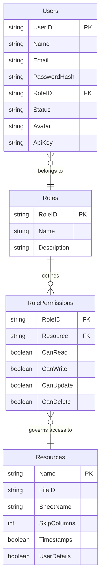

# Little Leap AQL - APP Google Sheet Structure

This document outlines the structure of the **APP** Google Sheet, which serves as the configuration and access control layer—the "brain"—of the Little Leap AQL system.

## Overview
The APP sheet manages user authentication, role-based access control (RBAC), and resource definitions. It is critical for the application's security and modularity.

---

## Sheet Breakdown

### 1. Users
**Purpose:** Stores user profile information and authentication credentials.
- **UserID (PK):** Unique identifier (Format: `U####`, e.g., `U0001`). Generated via auto-ID formula.
- **Name:** Full name of the user.
- **Email:** User's email address (used for login).
- **PasswordHash:** SHA-256 (Base64) hashed password.
- **RoleID (FK):** Reference to `Roles.RoleID`. (Many-to-One). Replaces the old `UserRoles` sheet.
- **Status:** User status (`Active` or `Inactive`). Managed via data validation.
- **Avatar:** URL or reference to the user's profile picture.
- **ApiKey:** Unique API key for programmatic access.

### 2. Roles
**Purpose:** Defines the roles available in the system (e.g., Administrator, Sales).
- **RoleID (PK):** Unique identifier (Format: `R####`, e.g., `R0001`). Generated via auto-ID formula.
- **Name:** Descriptive name of the role.
- **Description:** Details about the role's responsibilities.

### 3. RolePermissions
**Purpose:** Granular permissions for each role on specific resources.
- **RoleID (FK):** Reference to `Roles.RoleID`.
- **Resource:** The name of the resource (as defined in the `Resources` sheet).
- **CanRead:** Boolean (Checkbox).
- **CanWrite:** Boolean (Checkbox).
- **CanUpdate:** Boolean (Checkbox).
- **CanDelete:** Boolean (Checkbox).

### 4. Resources
**Purpose:** Registry of all entities/sheets managed by the system.
- **Name:** Unique resource identifier (e.g., `Products`, `Invoices`).
- **FileID:** The Google Sheet ID where the resource resides.
- **SheetName:** The specific sheet name within that file.
- **SkipColumns:** Number of columns to skip at the beginning of the sheet.
- **Timestamps:** Boolean. If true, `CreatedAt` and `UpdatedAt` fields are managed.
- **UserDetails:** Boolean. If true, `CreatedBy` and `UpdatedBy` (UserID) are tracked.

---

## Relationship Diagram

---

## Technical Details

### Auto-ID Generation
Sheets with a primary ID (Users, Roles) use a formula in the first data row (row 2) to automatically generate sequential IDs:
- **Formula:** `="U"&TEXT(ROW()-1,"0000")` (for Users)
- **Behavior:** Ensures unique, formatted identifiers that scale as rows are added.

### Data Validation
- **Status (Users):** Restricted to `Active` or `Inactive`.
- **Permissions (RolePermissions):** Implemented using Checkboxes for intuitive management.

### Management
The sheet structure is initialized and maintained via:
- `setupAppSheets.gs`: Idempotent script for creating sheets and formatting.
- `appMenu.gs`: Provides a custom "Little Leap" menu in the Google Sheet for CRUD operations on these masters.
