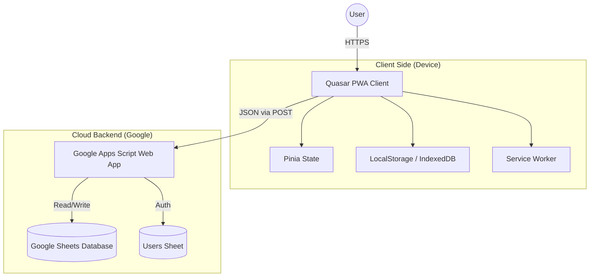

# System Architecture

## System Context Diagram

## Component Breakdown

### 1. Frontend (Quasar PWA)
*   **`src/layouts/MainLayout.vue`**: The core shell with navigation, header, and user profile controls.
*   **`src/stores/auth.js`**: Manages user session, login/logout, and token persistence.
*   **`src/boot/axios.js`**: Configures the global HTTP client with the GAS endpoint.

### 2. Backend Logic (Apps Script)
The logic is split across multiple `.gs` files for maintainability:

*   **`auth.gs`**: Handles `doPost` routing, login logic, password hashing, and token generation.
*   **`appMenu.gs`**: A standalone script that adds a custom menu *inside* the Google Sheet UI for administrators to manage users and permissions directly from the sheet.
*   **`setupAppSheets.gs`**: A utility script to initialize the sheet structure (create missing sheets, set headers) ensuring the DB schema is correct.

### 3. Database Layer (Google Sheets)
*   **`APP` Spreadsheet**: Contains configuration data (Users, Roles, Resources).
*   **`TRANSACTIONS` Spreadsheet**: High-volume data (Sales, Invoices).
*   **`MASTERS` Spreadsheet**: Static data (Products, Customers).

## Data Flow Example: Creating an Invoice

1.  **User Action**: Salesman fills invoice form in PWA.
2.  **Client Processing**: app validates input, calculates totals locally.
3.  **API Request**:
    *   `POST` to GAS URL.
    *   Payload: `{ action: "createInvoice", token: "...", data: { ...invoiceDetails } }`
4.  **Server Processing**:
    *   `auth.gs` validates token.
    *   Request routed to Invoice Service.
    *   Script locks the `Invoices` sheet.
    *   New row appended.
    *   Stock deducted from `Inventory` sheet.
5.  **Response**: JSON `{ success: true, invoiceId: "INV-1001" }` returned to PWA.
6.  **UI Update**: Success message shown, user redirected to list view.
